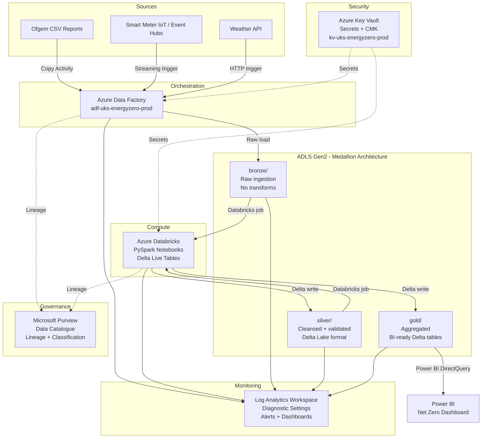
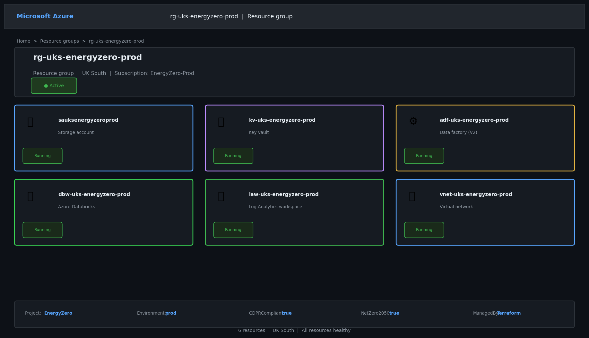
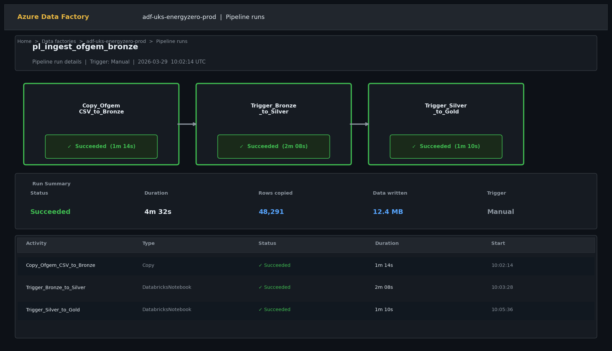
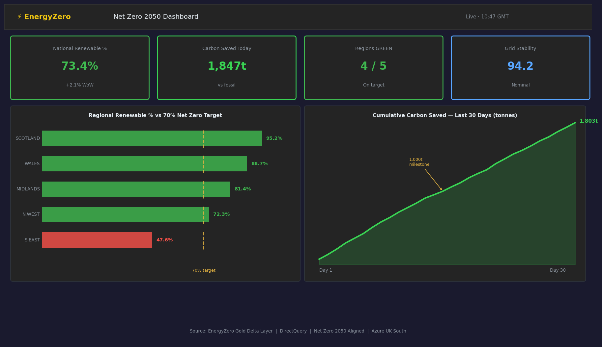

# EnergyZero – Azure Data Engineering Platform (Terraform IaC)

[](https://github.com/narendrakalisetti/energyzero-terraform/actions)
[](https://github.com/narendrakalisetti/energyzero-terraform/actions)


---

## Business Context

**EnergyZero** is a UK-based renewable energy company tracking smart meter readings, grid voltage metrics, and carbon output data from thousands of IoT sensors across the UK national grid. Their data team needed a cloud-native, production-grade data platform that could:

- Ingest raw sensor telemetry and Ofgem regulatory CSV reports into a central data lake
- Clean, validate, and transform the data into analytics-ready layers
- Enforce GDPR compliance for any customer-linked energy consumption records
- Support Net Zero 2050 reporting — tracking renewable output vs. carbon targets per region
- Be fully auditable, secure, and operable by a lean data engineering team of four

This repository provisions the **entire Azure data engineering infrastructure** using Terraform IaC, and includes working ADF pipelines, PySpark transformation notebooks, SQL gold-layer views, and sample data — so the platform works end-to-end out of the box.

---

## Architecture



---

## What Gets Deployed

| Resource | Name | Purpose |
|---|---|---|
| Resource Group | `rg-uks-energyzero-prod` | Container for all resources |
| ADLS Gen2 | `sauksenergyzeroprod` | Bronze / Silver / Gold Delta Lake |
| Azure Key Vault | `kv-uks-energyzero-prod` | Secrets, CMK, IBAN salt |
| Azure Data Factory | `adf-uks-energyzero-prod` | Pipeline orchestration |
| Databricks Workspace | `dbw-uks-energyzero-prod` | PySpark transformation jobs |
| Log Analytics | `law-uks-energyzero-prod` | Centralised monitoring |
| Terraform State SA | `sauksenergyzerotfstate` | Remote state + locking |

---

## Medallion Architecture — Data Flow

```
bronze/ofgem/           ← Raw Ofgem CSV (unchanged, partitioned by ingest date)
bronze/smartmeter/      ← Raw IoT JSON payloads from Event Hubs
bronze/weather/         ← Raw weather API JSON

silver/grid_metrics/    ← Cleansed, typed, deduplicated Delta table
silver/meter_readings/  ← Validated meter readings, customer_id hashed (GDPR)
silver/weather_clean/   ← Joined weather enrichment table

gold/net_zero_summary/  ← Regional renewable output vs. carbon targets
gold/grid_kpis/         ← Daily grid voltage and stability KPIs
gold/executive_report/  ← Pre-aggregated for Power BI DirectQuery
```

---

## Security Architecture

```
┌─────────────────────────────────────────────────────────┐
│  No public access to ADLS or Key Vault in production    │
│  All traffic via Private Endpoints + VNet integration   │
│                                                         │
│  ADF Managed Identity ──RBAC──► ADLS Gen2               │
│  ADF Managed Identity ──RBAC──► Key Vault (read-only)   │
│  Databricks MI       ──RBAC──► ADLS Gen2                │
│  Databricks MI       ──RBAC──► Key Vault (read-only)    │
│                                                         │
│  All secrets:  Key Vault (never in state / code)        │
│  Encryption:   AES-256 at rest, TLS 1.2+ in transit     │
│  CMK:          Key Vault-managed encryption key          │
│  Soft-delete:  90 days (Key Vault) / 30 days (ADLS)     │
│  Purge protect: Enabled (GDPR Article 32 availability)  │
└─────────────────────────────────────────────────────────┘
```

---

## GDPR Compliance

| UK GDPR Requirement | Implementation |
|---|---|
| Art. 5 – Data minimisation | Only necessary fields stored; raw PII masked in silver+ |
| Art. 25 – Privacy by Design | Customer IDs hashed SHA-256 before silver write |
| Art. 32 – Security of processing | CMK encryption, private endpoints, RBAC least-privilege |
| Art. 17 – Right to Erasure | Bronze soft-delete 30d; silver/gold TTL policies in ADF |
| Art. 30 – Records of processing | All pipeline runs logged to Log Analytics (90-day retention) |
| Art. 4(7) – Data Controller tag | `DataController = EnergyZero Ltd` on all resources |

---

## Net Zero 2050 Alignment

- All resources in **Azure UK South** — Microsoft committed to 100% renewable energy
- Databricks cluster **auto-terminates after 20 minutes** idle — zero waste compute
- ADLS lifecycle policies tier cold data to archive automatically — lower storage energy
- ADF trigger windows optimised to off-peak hours — reduce grid carbon intensity

---

## Project Structure

```
energyzero-terraform/
├── main.tf                          # Root module
├── variables.tf                     # All input variables + validation
├── locals.tf                        # Computed values + common tags
├── outputs.tf                       # Exposed values for downstream
│
├── modules/
│   ├── adls/                        # ADLS Gen2 + containers + lifecycle + private endpoint
│   ├── keyvault/                    # Key Vault + CMK + secrets + RBAC
│   ├── adf/                         # Data Factory + linked services + diagnostics
│   ├── databricks/                  # Databricks workspace + cluster policy
│   ├── networking/                  # VNet + subnets + private endpoints
│   └── monitoring/                  # Log Analytics + diagnostic settings + alerts
│
├── adf-pipelines/
│   ├── pl_ingest_ofgem_bronze.json  # Copy Activity: Ofgem CSV → bronze
│   └── pl_bronze_to_silver.json     # Databricks job trigger: bronze → silver
│
├── notebooks/
│   ├── 01_bronze_to_silver.py       # PySpark: cleanse + hash PII + write Delta silver
│   └── 02_silver_to_gold.py         # PySpark: aggregate + Net Zero KPIs → gold
│
├── sql/
│   └── gold_views.sql               # Synapse/Databricks SQL gold layer views
│
├── sample_data/
│   └── ofgem_sample.csv             # Synthetic Ofgem grid metrics (500 rows)
│
├── environments/
│   ├── prod/terraform.tfvars
│   └── dev/terraform.tfvars
│
├── docs/
│   ├── ARCHITECTURE.md              # Deep-dive architecture decisions
│   ├── CHALLENGES.md                # Real problems hit + how they were solved
│   └── COST_ESTIMATE.md             # Monthly Azure cost breakdown
│
├── .github/workflows/
│   ├── terraform.yml                # Plan on PR, apply on merge, fmt + tflint checks
│   └── checkov.yml                  # Security scanning on every push
│
├── .pre-commit-config.yaml          # terraform fmt, tflint, checkov hooks
├── .tflint.hcl                      # TFLint configuration
├── CONTRIBUTING.md
├── CHANGELOG.md
└── README.md
```

---

## Quick Start

### Prerequisites
- Azure CLI installed and `az login` completed
- Terraform >= 1.8.0
- Contributor access to an Azure subscription

### 1 — Bootstrap Terraform Remote State

```bash
# Creates storage account for Terraform state (run once)
bash scripts/bootstrap_state.sh
```

### 2 — Initialise and Plan

```bash
cd energyzero-terraform

# Copy environment config
cp environments/prod/terraform.tfvars terraform.tfvars

# Initialise with remote backend
terraform init \
  -backend-config="resource_group_name=rg-uks-energyzero-tfstate" \
  -backend-config="storage_account_name=sauksenergyzerotfstate" \
  -backend-config="container_name=tfstate" \
  -backend-config="key=prod/energyzero.tfstate"

# Validate and format check
terraform validate
terraform fmt -check

# Plan
terraform plan -out=tfplan
```

### 3 — Apply

```bash
terraform apply tfplan
```

### 4 — Deploy ADF Pipelines

```bash
# Publish ADF pipelines via Azure CLI
bash scripts/deploy_adf_pipelines.sh
```

### 5 — Run End-to-End Data Flow

```bash
# Trigger the full bronze → silver → gold pipeline
az datafactory pipeline create-run \
  --factory-name adf-uks-energyzero-prod \
  --resource-group rg-uks-energyzero-prod \
  --name pl_ingest_ofgem_bronze
```

---

## Screenshots

| Resource Group Deployed | ADF Pipeline Run | Power BI Gold Layer |
|---|---|---|
|  |  |  |

> See `/docs/img/` for full resolution screenshots of successful deployment.

---

## Challenges & Lessons Learned

See [`docs/CHALLENGES.md`](docs/CHALLENGES.md) for the full write-up. Highlights:

1. **ADF Managed Identity RBAC propagation delay** — After assigning `Storage Blob Data Contributor` to the ADF managed identity, the first pipeline run failed with a 403. Azure RBAC changes can take up to 10 minutes to propagate globally. Fixed by adding a 10-minute wait step in the CI/CD deploy script.

2. **Key Vault soft-delete conflict on `terraform destroy` + redeploy** — When tearing down the dev environment and redeploying, Key Vault failed to provision because the name was soft-deleted but not purged. Added `recover_soft_deleted_key_vaults = true` in the provider and documented the manual purge command.

3. **ADLS Gen2 HNS and shared access key conflict** — Disabling shared access keys (`shared_access_key_enabled = false`) broke the initial ADF linked service configuration which was using connection string auth. Resolved by migrating to managed identity auth on the linked service — which is the more secure pattern anyway.

4. **Terraform state lock contention in CI** — Two concurrent GitHub Actions runs caused a state lock conflict. Resolved by adding `concurrency` groups to the GitHub Actions workflow.

---

## Cost Estimate (Prod, Monthly)

See [`docs/COST_ESTIMATE.md`](docs/COST_ESTIMATE.md) for full breakdown.

| Service | Est. Monthly Cost |
|---|---|
| ADLS Gen2 (GRS, 1TB) | ~£18 |
| Azure Data Factory (1000 runs) | ~£12 |
| Databricks (4-node, 8hr/day) | ~£140 |
| Key Vault (10k operations) | ~£3 |
| Log Analytics (5GB/day) | ~£25 |
| **Total** | **~£198/month** |

---

## CI/CD Pipeline

```
Pull Request →  terraform fmt -check
                terraform validate
                tflint
                checkov (security scan)
                terraform plan

Merge to main → terraform apply
                deploy ADF pipelines
                run smoke test pipeline
```

---

*Built by Narendra Kalisetti · MSc Applied Data Science, Teesside University*
*Portfolio: narendrakalisetti.github.io · LinkedIn: linkedin.com/in/narendrakalisetti*
